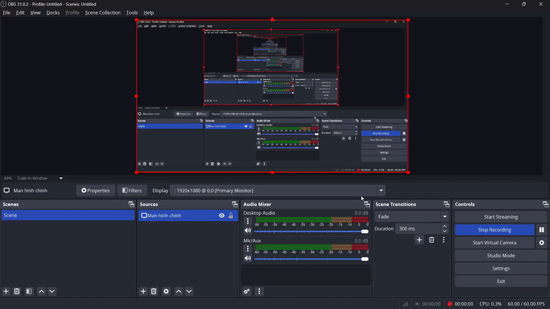
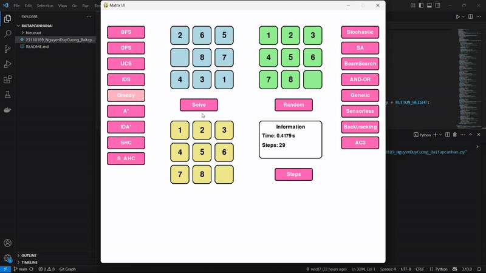

# Trình Giải 8-Puzzle Kết Hợp Trực Quan Thuật Toán Tìm Kiếm AI

Đây là một ứng dụng có giao diện người dùng (GUI) phát triển bằng thư viện Tkinter và Pygame trong Python, hỗ trợ người dùng theo dõi trực quan quá trình giải bài toán 8 ô chữ (8-Puzzle) thông qua nhiều thuật toán tìm kiếm khác nhau trong lĩnh vực Trí tuệ Nhân tạo (AI).

## Mục đích Dự Án

Mục tiêu chính của dự án gồm:

1.  **Minh họa sinh động** cách các thuật toán tìm kiếm giải quyết bài toán 8 ô chữ.
2.  Giúp người học dễ dàng **hiểu rõ các khái niệm nền tảng** trong AI như trạng thái, heuristic, và mô hình duyệt trạng thái.
3.  Cung cấp công cụ để **đánh giá và so sánh hiệu suất** các thuật toán về thời gian xử lý, số bước, và số trạng thái duyệt.

## Nội dung Chính

Dự án bao gồm các thành phần:

*   Cài đặt logic của 8-Puzzle và các thao tác xử lý trạng thái.
*   Tích hợp nhiều thuật toán tìm kiếm AI thuộc hai nhóm: không có thông tin và có thông tin.
*   Giao diện người dùng bằng Tkinter hiển thị trạng thái khởi đầu, trạng thái mục tiêu, quá trình giải và thống kê hiệu suất.
*   Hiệu ứng mô phỏng (animation) hành trình giải theo thuật toán.
*   Tạo tự động các trạng thái khởi đầu hợp lệ (giải được).

### 2.1. Thuật Toán Tìm Kiếm Không Có Thông Tin (Uninformed Search)

Nhóm này không sử dụng kiến thức nào về đích đến trong quá trình tìm kiếm. Thuật toán hoạt động dựa trên cấu trúc không gian trạng thái thuần túy.

* **Thành phần của bài toán:**
    * **State (Trạng thái):** Cấu trúc hiện tại của bàn cờ 8 ô.
    * **Initial State (Trạng thái bắt đầu):** `[[2, 6, 5], [0, 8, 7], [4, 3, 1]]`
    * **Goal State (Trạng thái mục tiêu):** `[[1, 2, 3], [4, 5, 6], [7, 8, 0]]`
    * **Actions (Hành động):** Di chuyển ô trống lên/xuống/trái/phải.
    * **Transition Model:** Mô tả trạng thái kế tiếp sau một hành động.
    * **Path Cost:** Tổng chi phí (1 cho mỗi bước).
    * **Solution:** Chuỗi hành động đưa trạng thái bắt đầu đến mục tiêu.

* **Thuật toán triển khai:**
    * **BFS (Breadth-First Search):** Tìm theo chiều rộng, duyệt theo từng lớp. Tối ưu và đầy đủ.
      
    * **DFS (Depth-First Search):** Tìm theo chiều sâu. Có sử dụng tập `visited` để tránh lặp vô hạn.
    * **UCS (Uniform Cost Search):** Luôn mở rộng nút có chi phí nhỏ nhất. Tối ưu và đầy đủ.
      
    * **IDS (Iterative Deepening Search):** Tìm kiếm sâu dần, tránh đệ quy sâu bằng cách lặp tường minh.
      

* **So sánh hiệu suất:**

    * **BFS:**
      
    * **DFS:**
      
    * **UCS:**
      
    * **IDS:**
      

* **Nhận xét tổng quan:**
    * **Độ dài lời giải (steps):**
        * BFS, UCS, IDS: 23 bước (tối ưu).
        * DFS: 7113 bước (không tối ưu).
    * **Số nút duyệt:**
        * DFS: 7297
        * UCS: 103936
        * BFS: 115372
        * IDS: 659337
    * **Thời gian:**
        * DFS: 0.604s (nhanh nhất)
        * BFS: 1.297s
        * UCS: 1.880s
        * IDS: 6.926s (chậm nhất)
    * **Tổng kết:** DFS chạy nhanh và duyệt ít nút nhưng lời giải rất dài. BFS, UCS và IDS tìm được lời giải tối ưu.

### 2.2. Thuật Toán Tìm Kiếm Có Thông Tin (Informed Search)

Các thuật toán này sử dụng heuristic (hàm ước lượng) để định hướng quá trình tìm kiếm, từ đó nâng cao hiệu quả.

* **Thành phần bài toán giống như nhóm trên**, bổ sung:
    * **Heuristic sử dụng:** **Khoảng cách Manhattan** – Tổng khoảng cách (ngang + dọc) từ vị trí hiện tại của mỗi ô đến vị trí mục tiêu. Đây là heuristic hợp lệ và nhất quán với bài toán 8-Puzzle.
 
* **Các thuật toán triển khai:**
    * **A\***: `f(n) = g(n) + h(n)` – đảm bảo tìm ra lời giải tối ưu với heuristic admissible.
      
    * **Greedy Best-First Search**: Chỉ dùng `h(n)` – thường nhanh nhưng không tối ưu.
      
    * **IDA\***: Giống A* nhưng dùng lặp sâu dần và ít tốn bộ nhớ.
      

* **Hình ảnh so sánh hiệu suất:**
    * A*:  
      
    * Greedy Best-First Search:  
      
    * IDA*:  
      

* **Nhận xét hiệu suất:**
    - **Độ dài đường đi:**
        - A* và IDA*: 23 bước (tối ưu).
        - Greedy: 79 bước.
    - **Số nút duyệt:**
        - Greedy: 455 nút (ít nhất).
        - A*: 1023 nút.
        - IDA*: 3209 nút (nhiều nhất).
    - **Thời gian thực thi:**
        - Greedy: 0.007s (nhanh nhất).
        - A*: 0.013s.
        - IDA*: 0.023s.
    - **Tổng hợp:**
        - A* và IDA* tìm lời giải tối ưu.
        - Greedy nhanh hơn nhưng không tối ưu.

---

### 2.3. Các thuật toán Tìm kiếm cục bộ (Local Search)

Các thuật toán này thường chỉ duy trì trạng thái hiện tại và di chuyển đến trạng thái lân cận tốt hơn.

* **Thành phần chính của bài toán:**
    * **Trạng thái (State):** Một cấu hình cụ thể của bàn cờ 8 ô chữ.
    * **Trạng thái bắt đầu:** `[[0, 1, 2], [4, 5, 3], [7, 8, 6]]`
    * **Trạng thái đích:** `[[1, 2, 3], [4, 5, 6], [7, 8, 0]]`
    * **Chi phí đường đi:** Mỗi bước = 1.

* **Thuật toán đã triển khai:**
    * **Simple Hill Climbing**
    * **Steepest Ascent Hill Climbing**
    * **Stochastic Hill Climbing**
      
    * **Simulated Annealing**
    * **Beam Search**
      
    * **Genetic Algorithm**
      

* **Hình ảnh so sánh hiệu suất:**
    - Simple Hill Climbing:  
      
    - Steepest HC:  
      
    - Stochastic HC:  
      
    - Simulated Annealing:  
      
    - Beam Search:  
      
    - Genetic Algorithm:  
      

* **Nhận xét hiệu suất:**
    - **Độ dài đường đi:**
        - Các Hill Climbing, Beam, Genetic: 4 bước.
        - Simulated Annealing: 23962 bước.
    - **Số nút duyệt:**
        - HC (3 loại): 4 nút.
        - Beam: 12 nút.
        - GA: 1128 nút.
        - SA: 24510 nút.
    - **Thời gian thực thi:**
        - HC và Beam: 0.000s.
        - GA: 0.074s.
        - SA: 0.286s.
    - **Tổng hợp:**
        - Hill Climbing, GA, Beam nhanh và hiệu quả.
        - SA tìm đường dài, tốn thời gian nhưng có khả năng thoát cực tiểu cục bộ.

---

### 2.4. Các thuật toán Tìm kiếm trong môi trường phức tạp

#### 2.4.1. Tìm kiếm trên môi trường niềm tin (Belief Space / Sensorless Search)

Giải quyết bài toán khi agent không biết chính xác trạng thái của mình.

* **Thành phần chính:**
    * **Trạng thái niềm tin:** Tập các trạng thái có thể.
    * **Niềm tin ban đầu:** `[[1, 2, 3], [4, 0, 5], [6, 7, 8]]`
    * **Hành động:** Áp dụng đồng loạt lên tất cả trạng thái trong tập niềm tin.
    * **Lời giải:** Dãy hành động đưa toàn bộ tập về trạng thái đích.

* **Thuật toán triển khai:**
    * **No Observation (Không quan sát được):**  
      Dùng BFS, không lọc được tập tin sau mỗi hành động.  
      
    * **Partially Observable (Quan sát được một phần):**  
      Dùng BFS kết hợp với lọc tập niềm tin sau khi nhận được thông tin quan sát.  
      

* **Hiệu suất so sánh:**
    - **Độ dài đường đi:** 14 bước cho cả hai.
    - **Số trạng thái duyệt:** 6413 trạng thái.
    - **Thời gian:**
        - No Observation: 13.775s.
        - Partially Observable: 6.117s.

* **Nhận xét:**
    - Không gian niềm tin lớn dẫn đến thời gian tìm kiếm dài.
    - Quan sát giúp giảm thời gian đáng kể.

---

#### 2.4.2. AND/OR (AOSearch)

Thuật toán thử nghiệm dựa trên logic AND/OR.

* **Logic hoạt động:**
    - Nút OR: thành công nếu *một nhánh con* dẫn đến lời giải.
    - Nút AND: thành công nếu *tất cả các nhánh con* dẫn đến lời giải.
    - Áp dụng trên không gian trạng thái 8-Puzzle, kiểm tra tất cả đường khả thi.

* **GIF minh họa hoạt động:**
     *(nếu có)*

* **Hiệu suất:**
    - **Số nút duyệt:** [Số lượng thực tế]
    - **Thời gian thực thi:** [Thời gian đo được]
    - **Độ dài lời giải:** [Số bước]

* **Nhận xét:**
    - AND/OR Search phù hợp với các bài toán cây điều kiện, không gian có ràng buộc logic hơn là tìm kiếm đường đi tuyến tính.
    - Khi áp dụng cho 8-Puzzle là không phổ biến và chủ yếu mang tính thử nghiệm.
 

### 2.5. Các Thuật toán Tìm kiếm có Ràng buộc (Constraint Satisfaction Problems - CSP)

Trong bài toán CSP, mục tiêu là tìm và gán giá trị cho một tập hợp các biến sao cho tất cả các ràng buộc giữa chúng đều được thỏa mãn. Dù bài toán 8-Puzzle không phải là một CSP điển hình, nhưng một số khái niệm và thuật toán trong CSP vẫn có thể áp dụng, chẳng hạn như:

- **Tạo một cấu hình bàn cờ hợp lệ:**  
  Các biến là 9 ô trên bàn cờ, mỗi biến nhận giá trị từ tập {0, 1, ..., 8}. Ràng buộc: mỗi giá trị phải xuất hiện đúng một lần.

- **Tìm một trạng thái bắt đầu có thể giải được:**  
  Bên cạnh cấu hình hợp lệ, ràng buộc bổ sung là trạng thái khởi đầu phải có cùng tính chẵn lẻ nghịch thế với trạng thái đích.

#### Các thành phần chính của bài toán CSP:

- **Biến (Variables):** Các ô trên bàn cờ 8-Puzzle.
- **Miền giá trị (Domains):** Tập giá trị có thể gán, ví dụ: {0, 1, 2, 3, 4, 5, 6, 7, 8}.
- **Ràng buộc (Constraints):** Mỗi giá trị xuất hiện đúng một lần, đảm bảo tính hợp lệ của trạng thái.

#### Các thuật toán được triển khai/áp dụng:

- **Backtracking:**  
  Thuật toán quay lui để sinh ra các cấu hình hợp lệ (hoán vị từ 0–8). Nếu việc gán không thỏa mãn ràng buộc, thuật toán sẽ quay lui.

  - **Backtracking cho BFS:**  
    

  - **Backtracking cho A\*:**  
    

  - **Backtracking cho Beam Search:**  
    

- **AC3 (Arc Consistency 3):**  
  Duy trì tính nhất quán cung giữa các biến. Loại bỏ các giá trị không thỏa mãn ràng buộc "tất cả các giá trị phải khác nhau".

  - **AC3 cho BFS:**  
    

  - **AC3 cho A\*:**  
    

  - **AC3 cho Beam Search:**  
    

#### Hình ảnh so sánh hiệu suất:

- **Backtracking cho BFS:**  
  

- **AC3 cho BFS:**  
  

- **Backtracking cho A\*:**  
  

- **AC3 cho A\*:**  
  

- **Backtracking cho Beam Search:**  
  

- **AC3 cho Beam Search:**  
  

---

### So sánh Hiệu suất Sinh trạng thái: Backtracking vs AC3

| Phương pháp sinh   | Thuật toán kiểm tra | Path Steps (Sinh) | Time (s) | 
|--------------------|---------------------|-------------------|----------|
| **Backtracking**   | A\*                 | 50                | **0.004**|
| AC3                | A\*                 | 106               | 0.008    | 
| **Backtracking**   | BeamSearch          | 22                | 1.133    |
| AC3                | BeamSearch          | 25                | **2.188**|
| **Backtracking**   | BFS                 | 17                | **0.002**|
| AC3                | BFS                 | 22                | 0.055    |

---

### Nhận xét:

1. **Về Thời gian và Số nút:**
   - Phương pháp **Backtracking** cho kết quả nhanh hơn và duyệt ít nút hơn so với AC3 ở cả ba thuật toán (A\*, BeamSearch, BFS).
   - Đặc biệt, sự khác biệt rõ nhất thể hiện ở BeamSearch và BFS.

2. **Về Số bước sinh (Path Steps):**
   - Backtracking tạo trạng thái với số bước sinh ít hơn trong BeamSearch và BFS.
   - Riêng với A\*, AC3 sinh ra trạng thái có số bước ít hơn nhưng mất nhiều thời gian và duyệt nhiều nút hơn.

### Kết luận:

Phương pháp **Backtracking** cho thấy hiệu quả cao hơn trong việc sinh ra trạng thái bắt đầu phù hợp so với **AC3**, thể hiện qua thời gian xử lý nhanh hơn và số lượng nút duyệt ít hơn trong phần lớn các trường hợp.

---

## 3. Kết luận

Dự án **"8-Puzzle Solver Visualization"** là công cụ học tập trực quan, giúp người học hiểu sâu về các thuật toán tìm kiếm trong trí tuệ nhân tạo. Thông qua việc mô phỏng quá trình duyệt trạng thái và so sánh hiệu suất các thuật toán, người dùng sẽ nhận thức rõ hơn về ưu/nhược điểm và phạm vi ứng dụng của từng phương pháp. Dự án cũng minh họa tầm quan trọng của việc lựa chọn đúng thuật toán và cấu trúc dữ liệu phù hợp với từng bài toán cụ thể.

