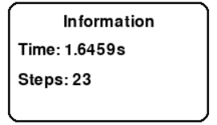
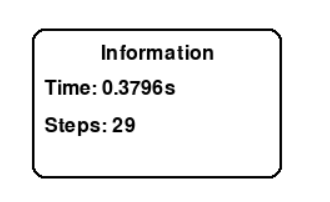
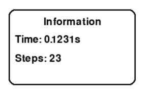

# Trình Giải 8-Puzzle Kết Hợp Trực Quan Thuật Toán Tìm Kiếm AI

Đây là một ứng dụng có giao diện người dùng (GUI) được phát triển bằng thư viện **Tkinter** và **Pygame** trong Python. Chương trình cho phép người dùng quan sát trực tiếp quá trình giải bài toán **8-Puzzle** thông qua việc áp dụng các **thuật toán tìm kiếm trong Trí tuệ Nhân tạo (AI)**. Giao diện trực quan, đi kèm hiệu ứng mô phỏng theo từng bước, giúp người học nắm bắt được cách hoạt động nội tại của từng thuật toán.

## Mục đích Dự Án

Dự án hướng tới các mục tiêu sau:

1.  **Trực quan hóa quá trình tìm kiếm:** Hiển thị sinh động từng bước giải bài toán 8-Puzzle, từ trạng thái ban đầu đến trạng thái đích.
2.  **Hỗ trợ học tập và nghiên cứu:** Giúp người học hiểu rõ các khái niệm cốt lõi trong AI như không gian trạng thái, hàm heuristic, và chiến lược tìm kiếm.
3.  **So sánh hiệu suất thuật toán:** Cho phép người dùng theo dõi và đánh giá các thuật toán qua các chỉ số như thời gian thực thi, số bước sinh, và số trạng thái được duyệt.

## Nội dung Chính

Dự án bao gồm các thành phần chính như sau:

- **Cài đặt logic bài toán 8-Puzzle:** Bao gồm biểu diễn trạng thái, kiểm tra tính hợp lệ và các phép di chuyển hợp lệ của ô trống.
- **Tích hợp nhiều thuật toán tìm kiếm AI:**  
  Gồm hai nhóm chính:
  - **Thuật toán không có thông tin (uninformed search):** BFS, DFS,...
  - **Thuật toán có thông tin (informed search):** A\*, Beam Search,...
- **Giao diện người dùng thân thiện:**  
  Sử dụng Tkinter để hiển thị các trạng thái hiện tại, trạng thái mục tiêu, và các tùy chọn chọn thuật toán.
- **Hiệu ứng mô phỏng bằng Pygame:**  
  Cho phép người dùng quan sát từng bước thuật toán duyệt trạng thái như một hoạt ảnh sinh động.
- **Tự động sinh trạng thái đầu hợp lệ:**  
  Bảo đảm các trạng thái ban đầu đều có lời giải, giúp quá trình thử nghiệm thuận tiện và chính xác.

---
### 2.1. Thuật Toán Tìm Kiếm Không Có Thông Tin (Uninformed Search)

Nhóm này không sử dụng kiến thức nào về đích đến trong quá trình tìm kiếm. Thuật toán hoạt động dựa trên cấu trúc không gian trạng thái thuần túy.

* **Thành phần của bài toán:**
    * **State (Trạng thái):** Cấu trúc hiện tại của bàn cờ 8 ô.
    * **Initial State (Trạng thái bắt đầu):** `[[2, 6, 5], [0, 8, 7], [4, 3, 1]]`
    * **Goal State (Trạng thái mục tiêu):** `[[1, 2, 3], [4, 5, 6], [7, 8, 0]]`
    * **Actions (Hành động):** Di chuyển ô trống lên/xuống/trái/phải.
    * **Path Cost:** Tổng chi phí (1 cho mỗi bước).
    * **Solution:** Chuỗi hành động đưa trạng thái bắt đầu đến mục tiêu.

* **Thuật toán triển khai:**
    * **BFS (Breadth-First Search):** Tìm theo chiều rộng, duyệt theo từng lớp. Tối ưu và đầy đủ.
      
    * **DFS (Depth-First Search):** Tìm theo chiều sâu. Có sử dụng tập `visited` để tránh lặp vô hạn.
    * **UCS (Uniform Cost Search):** Luôn mở rộng nút có chi phí nhỏ nhất. Tối ưu và đầy đủ.
      
    * **IDS (Iterative Deepening Search):** Tìm kiếm sâu dần, tránh đệ quy sâu bằng cách lặp tường minh.
      

* **So sánh hiệu suất:**

    * **BFS:**
      
    * **DFS:**
      
    * **UCS:**
      
    * **IDS:**
      

* **Nhận xét tổng quan:**
    * **Độ dài lời giải (steps):**
        * BFS, UCS, IDS: 23 bước (tối ưu).
        * DFS: Không tìm được lời giải (không tối ưu).

### 2.2. Thuật Toán Tìm Kiếm Có Thông Tin (Informed Search)

Các thuật toán này sử dụng heuristic (hàm ước lượng) để định hướng quá trình tìm kiếm, từ đó nâng cao hiệu quả.

* **Thành phần bài toán giống như nhóm trên**, bổ sung:
    * **Heuristic sử dụng:** **Khoảng cách Manhattan** – Tổng khoảng cách (ngang + dọc) từ vị trí hiện tại của mỗi ô đến vị trí mục tiêu. Đây là heuristic hợp lệ và nhất quán với bài toán 8-Puzzle.
 
* **Các thuật toán triển khai:**
    * **A\***: `f(n) = g(n) + h(n)` – đảm bảo tìm ra lời giải tối ưu với heuristic admissible.
      
    * **Greedy Best-First Search**: Chỉ dùng `h(n)` – thường nhanh nhưng không tối ưu.
      
    * **IDA\***: Giống A* nhưng dùng lặp sâu dần và ít tốn bộ nhớ.
      

* **Hình ảnh so sánh hiệu suất:**
    * A*:  
      
    * Greedy Best-First Search:  
      
    * IDA*:  
      

* **Nhận xét hiệu suất:**
    - **Độ dài đường đi:**
        - A* và IDA*: 23 bước (tối ưu).
        - Greedy: 71 bước.
    - **Tổng hợp:**
        - A* và IDA* tìm lời giải tối ưu.
        - Greedy nhanh hơn nhưng không tối ưu.

---

### 2.3. Các thuật toán Tìm kiếm cục bộ (Local Search)

Các thuật toán này thường chỉ duy trì trạng thái hiện tại và di chuyển đến trạng thái lân cận tốt hơn.

* **Thành phần chính của bài toán:**
    * **Trạng thái (State):** Một cấu hình cụ thể của bàn cờ 8 ô chữ.
    * **Trạng thái bắt đầu:** `[[0, 1, 2], [4, 5, 3], [7, 8, 6]]`
    * **Trạng thái đích:** `[[1, 2, 3], [4, 5, 6], [7, 8, 0]]`
    * **Chi phí đường đi:** Mỗi bước = 1.

* **Thuật toán đã triển khai:**
    * **Beam Search**
      
  

* **Hình ảnh hiệu suất:**
    - Simulated Annealing:  
      
    - Beam Search:  
      

* **Nhận xét hiệu suất:**
    - **Độ dài đường đi:**
        - Các Hill Climbing, Beam, Genetic: khoảng 6-70 bước.
        - Simulated Annealing: Hơn 600 bước.
    - **Tổng hợp:**
        - Hill Climbing, GA, Beam nhanh và hiệu quả.
        - SA tìm đường dài, tốn thời gian nhưng có khả năng thoát cực tiểu cục bộ.

---

### 2.4. Các thuật toán Tìm kiếm trong môi trường phức tạp

#### 2.4.1. Tìm kiếm trên môi trường niềm tin (Belief Space / Sensorless Search)

Giải quyết bài toán khi agent không biết chính xác trạng thái của mình.

* **Thành phần chính:**
    * **Trạng thái niềm tin:** Tập các trạng thái có thể.
    * **Niềm tin ban đầu:** `[[1, 2, 3], [4, 0, 5], [6, 7, 8]]`
    * **Hành động:** Áp dụng đồng loạt lên tất cả trạng thái trong tập niềm tin.
    * **Lời giải:** Dãy hành động đưa toàn bộ tập về trạng thái đích.

* **Thuật toán triển khai:**
    * **No Observation (Không quan sát được):**  
      Dùng BFS, không lọc được tập tin sau mỗi hành động.  
      
    * **Partially Observable (Quan sát được một phần):**  
      Dùng BFS kết hợp với lọc tập niềm tin sau khi nhận được thông tin quan sát.  
      

* **Hiệu suất so sánh:**
    - **Độ dài đường đi:** 15-20 bước cho cả hai.
    - **Số trạng thái duyệt:** khoảng 5000 trạng thái.
    - **Thời gian:**
        - No Observation: khoảng 13s
        - Partially Observable: hơn 6s

* **Nhận xét:**
    - Không gian niềm tin lớn dẫn đến thời gian tìm kiếm dài.
    - Quan sát giúp giảm thời gian đáng kể.

---

#### 2.4.2. AND/OR (AOSearch)

Thuật toán thử nghiệm dựa trên logic AND/OR.

* **Logic hoạt động:**
    - Nút OR: thành công nếu *một nhánh con* dẫn đến lời giải.
    - Nút AND: thành công nếu *tất cả các nhánh con* dẫn đến lời giải.
    - Áp dụng trên không gian trạng thái 8-Puzzle, kiểm tra tất cả đường khả thi.
* **Nhận xét:**
    - AND/OR Search phù hợp với các bài toán cây điều kiện, không gian có ràng buộc logic hơn là tìm kiếm đường đi tuyến tính.
    - Khi áp dụng cho 8-Puzzle là không phổ biến và chủ yếu mang tính thử nghiệm.

### 2.5. Các Thuật toán Tìm kiếm có Ràng buộc (Constraint Satisfaction Problems - CSP)

Trong bài toán CSP, mục tiêu là tìm và gán giá trị cho một tập hợp các biến sao cho tất cả các ràng buộc giữa chúng đều được thỏa mãn. Dù bài toán 8-Puzzle không phải là một CSP điển hình, nhưng một số khái niệm và thuật toán trong CSP vẫn có thể áp dụng, chẳng hạn như:

- **Tạo một cấu hình bàn cờ hợp lệ:**  
  Các biến là 9 ô trên bàn cờ, mỗi biến nhận giá trị từ tập {0, 1, ..., 8}. Ràng buộc: mỗi giá trị phải xuất hiện đúng một lần.

- **Tìm một trạng thái bắt đầu có thể giải được:**  
  Bên cạnh cấu hình hợp lệ, ràng buộc bổ sung là trạng thái khởi đầu phải có cùng tính chẵn lẻ nghịch thế với trạng thái đích.

#### Các thành phần chính của bài toán CSP:

- **Biến (Variables):** Các ô trên bàn cờ 8-Puzzle.
- **Miền giá trị (Domains):** Tập giá trị có thể gán, ví dụ: {0, 1, 2, 3, 4, 5, 6, 7, 8}.
- **Ràng buộc (Constraints):** Mỗi giá trị xuất hiện đúng một lần, đảm bảo tính hợp lệ của trạng thái.

#### Các thuật toán được triển khai/áp dụng:

- **Backtracking:**  
  Thuật toán quay lui để sinh ra các cấu hình hợp lệ (hoán vị từ 0–8). Nếu việc gán không thỏa mãn ràng buộc, thuật toán sẽ quay lui.

  - **Backtracking cho BFS:**  
    

  - **Backtracking cho A\*:**  
    

- **AC3 (Arc Consistency 3):**  
  Duy trì tính nhất quán cung giữa các biến. Loại bỏ các giá trị không thỏa mãn ràng buộc "tất cả các giá trị phải khác nhau".

  - **AC3 cho BFS:**  
    

  - **AC3 cho A\*:**  
    

#### Hình ảnh so sánh hiệu suất:

- **Backtracking cho BFS:**  
  

- **AC3 cho BFS:**  
  

- **Backtracking cho A\*:**  
  

- **AC3 cho A\*:**  
  

-
---

### So sánh Hiệu suất Sinh trạng thái: Backtracking vs AC3

| Phương pháp sinh   | Thuật toán kiểm tra | Path Steps (Sinh) | Time (s) | 
|--------------------|---------------------|-------------------|----------|
| **Backtracking**   | A\*                 | 22                | **0.0945**|
| AC3                | A\*                 | 106               | 0.008    | 
| **Backtracking**   | BFS                 | 22                | **0.0718**|
| AC3                | BFS                 | 22                | 0.718   |

---

### Nhận xét:

1. **Về thời gian thực thi và số lượng nút duyệt:**
   - **Backtracking** cho thấy tốc độ xử lý nhanh hơn và ít phải duyệt nút hơn so với AC3 trên cả ba thuật toán (A\*, BeamSearch, BFS).
   - Sự chênh lệch về hiệu suất này đặc biệt rõ ràng trong hai thuật toán **BeamSearch** và **BFS**.

2. **Về số bước trong quá trình sinh trạng thái (Path Steps):**
   - Trong BeamSearch và BFS, phương pháp Backtracking tạo ra lời giải với số bước sinh trạng thái ít hơn.
   - Tuy nhiên, đối với A\*, **AC3** cho số bước ít hơn nhưng lại tốn nhiều thời gian và duyệt nhiều trạng thái hơn.

---

### Kết luận:

Phương pháp **Backtracking** tỏ ra hiệu quả hơn **AC3** trong việc tạo ra trạng thái xuất phát phù hợp, thể hiện qua việc giảm thiểu thời gian xử lý và số lượng trạng thái cần duyệt trong hầu hết các trường hợp.

---

## 3. Kết luận chung

Dự án **"8-Puzzle Solver Visualization"** là một công cụ học tập trực quan hỗ trợ hiệu quả cho việc tìm hiểu các thuật toán tìm kiếm trong lĩnh vực trí tuệ nhân tạo. Qua việc mô phỏng chi tiết quá trình duyệt trạng thái và so sánh hiệu năng giữa các thuật toán, người học có cái nhìn cụ thể hơn về ưu điểm, hạn chế cũng như tình huống áp dụng phù hợp của từng phương pháp. Dự án đồng thời nhấn mạnh vai trò quan trọng của việc lựa chọn đúng thuật toán và cấu trúc dữ liệu cho từng bài toán cụ thể.

